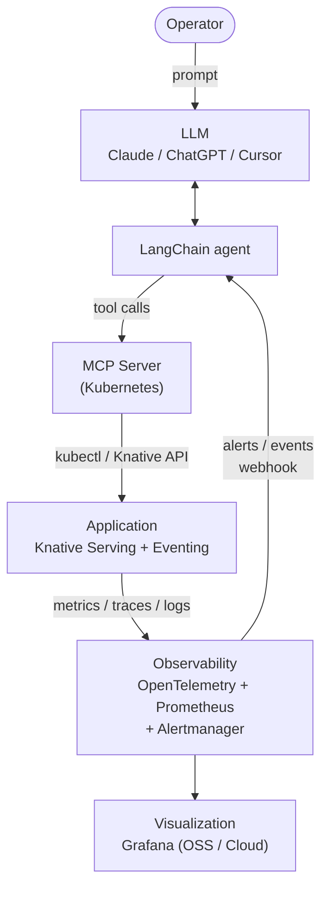
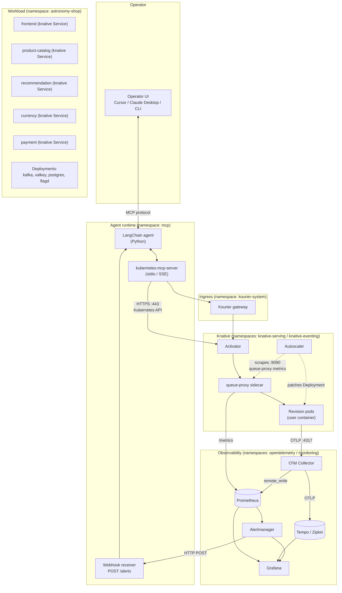
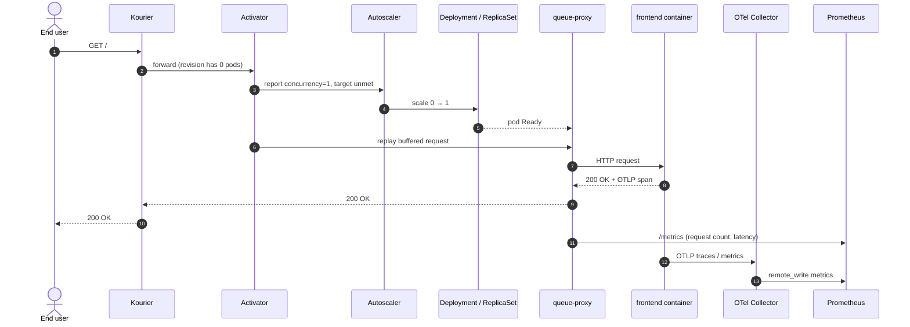
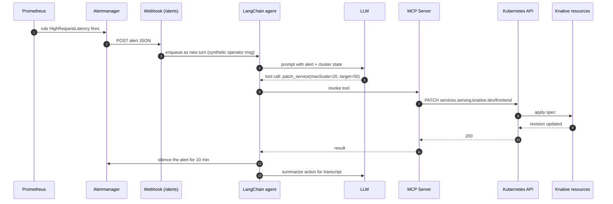
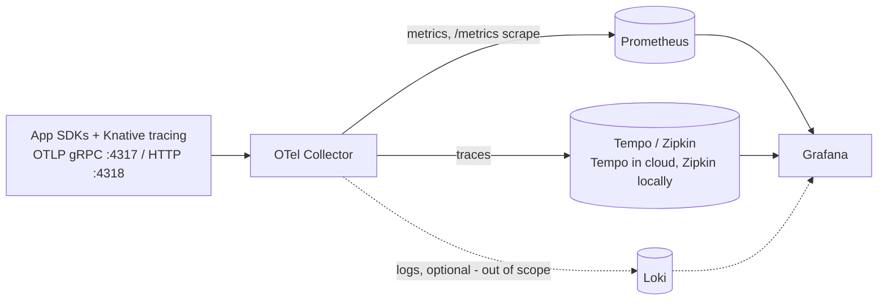

# Knative-O — Serverless Application Observability (Project Type 1)

**Authors:**
- Stanisław Barycki
- Eryk Olejarz
- Paweł Prus
- Kacper Szot

---

## Project Description

The goal of this project is to demonstrate **LLM-driven deployment and management** of a serverless microservice application running on **Knative**, with a full observability pipeline built on **OpenTelemetry**, **Prometheus**, and **Grafana**.

The user issues natural-language commands to an LLM (e.g. Claude), which — through **LangChain** and a **Kubernetes MCP Server** — performs real operations on the cluster: deploying Knative Services, managing revisions, configuring traffic splitting, and adjusting autoscaling. The effects of these operations are then observed and visualized through the observability stack.

---

## Table of Contents

1. [Introduction](#1-introduction)
2. [Theoretical Background / Technology Stack](#2-theoretical-background--technology-stack)
3. [Case Study Concept](#3-case-study-concept)
4. [High-Level Architecture](#4-high-level-architecture)
5. [Detailed Architecture](#5-detailed-architecture)
6. [Environment Configuration](#6-environment-configuration)
7. [Installation Method](#7-installation-method)
8. [Demo Deployment Steps](#8-demo-deployment-steps)
9. [Demo Description](#9-demo-description)
10. [Summary and Conclusions](#10-summary-and-conclusions)
11. [References](#11-references)

---

## 1. Introduction

Serverless platforms like Knative simplify application deployment by automating scaling, traffic routing, and revision management. However, operating such systems effectively still requires deep Kubernetes knowledge and manual YAML editing.

This project explores whether an **LLM can replace manual kubectl/YAML workflows** for managing Knative applications. The LLM communicates with the cluster through a Kubernetes MCP Server and performs deployments, configuration changes, and diagnostics — all from natural-language prompts. A full observability stack (OpenTelemetry → Prometheus → Grafana) allows us to verify and visualize the results.

---

## 2. Theoretical Background / Technology Stack

| Component | Technology | Role |
|-----------|-----------|------|
| Orchestration | **Kubernetes** | Container and infrastructure management |
| Serverless Platform | **Knative** (Serving + Eventing) | Autoscaling, revisions, traffic splitting, event-driven communication |
| Telemetry Collection | **OpenTelemetry** | Collecting traces, metrics, and logs from applications and Knative components |
| Metrics Storage | **Prometheus** | Time-series metrics storage and querying (PromQL) |
| Visualization | **Grafana** | Dashboards for metrics, traces, and logs |
| AI Bridge | **MCP Server** (Kubernetes) | Protocol exposing kubectl operations as tools for the LLM |
| Integration | **LangChain** | Framework connecting the LLM to MCP Server tools |
| Brain | **LLM** (Claude / ChatGPT) | Natural-language interface for cluster management |

### Knative

Knative is an open-source platform running on Kubernetes for serverless and event-driven applications. It has two main components:

- **Knative Serving** — deployment, autoscaling (including scale-to-zero), revision management, and traffic splitting between versions.
- **Knative Eventing** — event-driven communication using brokers, triggers, and the CloudEvents specification.

Knative natively supports observability: it emits metrics in Prometheus/OTLP formats, propagates trace context in HTTP headers, and its data-plane components (activator, queue-proxy) are instrumented out of the box.

### Kubernetes MCP Server

The [Kubernetes MCP Server](https://github.com/containers/kubernetes-mcp-server) implements the Model Context Protocol, exposing Kubernetes operations as callable tools for LLMs. It allows the LLM to create, modify, and delete resources, read cluster state, and apply YAML manifests — effectively replacing manual `kubectl` usage.

### OpenTelemetry, Prometheus & Grafana

OpenTelemetry collects telemetry (traces, metrics, logs) from both the application and Knative infrastructure via the OTel Collector. Prometheus stores time-series metrics and serves as the data source for Grafana, which provides the visualization layer. The `knative-extensions/monitoring` repository offers ready-made Grafana dashboards for Knative.

### 2.1 Technology Decisions for the Demo

Below is the rationale behind each technology chosen for the demo, including the alternatives considered and the reason for rejection. The selection is driven by three constraints: (1) the demo must run on a single laptop-grade Kubernetes cluster, (2) every component must expose telemetry that can be visualized end-to-end, and (3) the LLM must be able to drive the cluster through a documented, vendor-neutral protocol.

| # | Decision area | Chosen technology | Alternatives considered | Rationale |
|---|---------------|-------------------|-------------------------|-----------|
| 1 | Container orchestrator | **Kubernetes** (kind / managed) | Docker Swarm, Nomad | De-facto standard; required by Knative and the MCP server; works identically locally and in the cloud. |
| 2 | Serverless layer | **Knative Serving + Eventing** | OpenFaaS, Kubeless, KEDA-only, AWS Lambda | Knative is the only CNCF-incubating serverless layer that runs on any Kubernetes, provides revision-level traffic splitting and scale-to-zero out of the box, and is natively instrumented (queue-proxy/activator emit Prometheus + OTLP). The project topic explicitly names Knative. |
| 3 | Telemetry pipeline | **OpenTelemetry Collector** (OTLP) | Direct Prometheus scrape only, Jaeger agent, Fluent Bit only | OTel is vendor-neutral and unifies traces, metrics and logs in one pipeline. The Collector lets us fan out to Prometheus (metrics) and to a tracing backend without re-instrumenting the app. |
| 4 | Metrics backend | **Prometheus** (kube-prometheus-stack) | VictoriaMetrics, Thanos, Mimir | Native target for Knative metrics, smallest footprint for a demo, the `kube-prometheus-stack` Helm chart bundles Alertmanager and node/k8s exporters with sane defaults. |
| 5 | Visualization | **Grafana (OSS)** + ready-made Knative dashboards | Grafana Cloud, Kiali, custom UI | OSS Grafana runs in-cluster, no account required for evaluation. We import dashboards from `knative-extensions/monitoring` so the demo shows production-grade panels from minute one. |
| 6 | LLM bridge | **Kubernetes MCP Server** (containers/kubernetes-mcp-server) | Custom kubectl wrapper, `kubectl-ai`, K8sGPT | MCP is the protocol Claude/Cursor speak natively; one server exposes the full kubectl surface as typed tools, so the LLM cannot escape sandboxing and every call is auditable. |
| 7 | LLM orchestration | **LangChain** (Python) + Claude / ChatGPT | Direct SDK calls, LlamaIndex, custom agent loop | LangChain has first-class MCP support (`langchain-mcp-adapters`), built-in tool calling, conversation memory and tracing — minimal glue code for the demo. |
| 8 | LLM | **Claude (Sonnet/Opus)** with ChatGPT as fallback | Local LLMs (Llama, Mistral) | Frontier models needed for reliable multi-step tool use on Kubernetes manifests; local models are too weak for correct YAML/CRD generation in a short demo. |
| 9 | Demo workload | **OpenTelemetry Astronomy Shop** | Google Online Boutique, knative-demo, knative-tracing | The only candidate that ships with native OTel instrumentation, a built-in load generator, and Prometheus/Grafana wiring — minimizes instrumentation work and lets us focus on the LLM-driven Knative scenarios. See §3.2 for the comparison matrix. |
| 10 | Cluster runtime | **kind** (local) + **GKE/EKS/AKS** (cloud variant) | minikube, k3d, Docker Desktop K8s | kind is the most reproducible single-binary local cluster and the one used by Knative's own quickstart; for a cloud demo we keep the manifests portable to any managed Kubernetes. See §6. |

**Out of scope for the demo (deliberate cuts):** service mesh (Istio/Linkerd), GitOps (Argo CD/Flux), policy engines (OPA/Kyverno), log aggregation (Loki/ELK). They would obscure the LLM ↔ Knative interaction without adding to the project's research question.

---

## 3. Case Study Concept

### 3.1 Project Goals

- **LLM-driven Knative management:** Deploy and configure serverless applications using natural-language prompts instead of manual YAML/kubectl.
- **Full observability pipeline:** Instrument the application with OpenTelemetry, collect metrics with Prometheus, visualize with Grafana.
- **Verify LLM operations through observability:** Use dashboards to confirm that LLM-driven deployments, scaling changes, and traffic splits work correctly.
- **Reproducibility:** The whole demo must come up on a laptop-class machine from a single bootstrap script and be tearable down to zero with one command.

### 3.2 Demo Application — Selection

We evaluated four candidate applications against four criteria: (a) native OpenTelemetry instrumentation, (b) microservice count meaningful enough to show scale-to-zero and traffic splits, (c) availability of a load generator, (d) effort needed to deploy on Knative.

| Application | OTel native | µservices | Load gen | Knative effort | Verdict |
|-------------|:-----------:|:---------:|:--------:|:--------------:|---------|
| **OpenTelemetry Astronomy Shop** | ✅ | 14 | ✅ (built-in) | Medium — convert `Deployment` → `Service` (Knative) for selected services | **Selected** |
| Google Online Boutique | ❌ (needs adding) | 11 | ✅ (locust) | Medium + instrumentation work | Rejected — instrumentation overhead |
| Knative Eventing Demo | partial | 3 | ❌ | Low | Rejected — too small to show autoscaling differences |
| Knative Tracing Demo | ✅ (traces only) | 2 | ❌ | Low | Rejected — too narrow, traces only |

**Chosen application: [OpenTelemetry Astronomy Shop](https://github.com/open-telemetry/opentelemetry-demo)** — a polyglot (Go, Java, Python, .NET, Node.js, Rust, Ruby, PHP) e-commerce reference application maintained by the OpenTelemetry project. It ships with native OTel SDKs in every service, a `loadgenerator` based on Locust, a feature-flag service, and pre-built Grafana dashboards.

**What the application models.** The Astronomy Shop is a fictitious online store selling telescopes and astronomy gear. It models a realistic e-commerce checkout flow: a customer browses the product catalog on the **`frontend`** (Next.js), gets personalized suggestions from **`recommendation`**, asks the **`ad`** service for banners, adds items to a basket held by **`cart`** (backed by Valkey/Redis), and proceeds to checkout. **`checkout`** orchestrates the order — it converts prices through **`currency`**, calculates shipping via **`shipping`**, charges via **`payment`**, asks **`email`** to confirm, publishes the resulting order onto **Kafka**, and **`accounting`** + **`fraud-detection`** consume that stream asynchronously. A **`quote`** service prices the package, **`product-catalog`** serves product data, and a separate **`image-provider`** serves product images. Cross-cutting components — **`load-generator`** (synthetic traffic) and **`flagd` / `feature-flag`** (toggles that intentionally inject faults like a broken `paymentService` or slow `recommendationCache`) — let us reproduce realistic failure modes on demand. The whole flow is instrumented end-to-end with traces, metrics and logs, which is exactly the property we exploit to verify LLM-driven Knative operations.

For our demo we will:

1. Deploy a **subset** of the services as Knative Services so we can demonstrate scale-to-zero and revision/traffic splitting on real, end-user-facing components (`frontend`, `productcatalog`, `recommendation`, `currency`, `payment`).
2. Keep the **stateful** components (`kafka`, `valkey/redis`, `postgres`, `featureflag`) as regular Deployments + Services — Knative Serving is not suitable for stateful workloads.
3. Replace the demo's bundled OTel Collector / Prometheus / Grafana with our own observability stack so it also receives metrics from the Knative control plane (activator, autoscaler, queue-proxy).

### 3.3 Demo Scenarios

The demo is structured as a single, narrated session in which the operator types only natural-language prompts; every observable change is shown live in Grafana on a second screen.

| # | Scenario | Operator prompt (example) | LLM action | Observable result in Grafana |
|---|----------|---------------------------|-------------|------------------------------|
| 1 | **Cold-start deployment** | "Deploy the Astronomy Shop frontend on Knative with min-scale 0." | Generates `Service` manifest, applies via MCP, waits for `Ready`. | New revision appears in *Knative Serving* dashboard; pod count goes 0→1 on first request. |
| 2 | **Canary traffic split** | "Roll out a v2 of `recommendation` taking 10 % of traffic." | Creates a new revision and patches the `Service` with a 90/10 `traffic` block. | Per-revision request rate panel shows ~10 % share on v2; error/latency comparison side-by-side. |
| 3 | **Autoscaling tune** | "If load spikes, scale `frontend` up faster — target 50 RPS per pod, max 20." | Sets `autoscaling.knative.dev/target` and `maxScale` annotations. | Concurrency vs. pod-count panel responds: pods scale up sooner under load-generator traffic. |
| 4 | **Scale-to-zero proof** | "Stop traffic to `payment` and show me when it scales to zero." | Pauses the load generator for that service, watches pod count. | *Active pods* panel drops to 0 after the grace period; first cold request shows the activator's TTFB spike. |
| 5 | **Diagnosis** | "Why is the cart service failing?" | Reads pod status, recent events, last log lines through MCP; suggests a fix (e.g. wrong env var). | Trace waterfall in Grafana shows the failing span; LLM proposes a patch that the operator applies. |
| 6 | **Rollback** | "Roll back `recommendation` to the previous revision." | Patches `Service` traffic to 100 % on previous revision. | Traffic shifts back; error-rate panel returns to baseline within seconds. |
| 7 | **Reactive autoscale (closed-loop)** | *(no operator prompt — triggered by Alertmanager)* | Alert `HighRequestLatency` on `frontend` fires → webhook wakes the LangChain agent → LLM inspects current `maxScale` and concurrency, raises `maxScale` and lowers concurrency target via MCP. | Alert clears in Grafana; pod count and latency panels show the LLM's intervention; the agent posts a short justification to the transcript. |

### 3.4 Acceptance Criteria

The demo is considered successful when, during a single live run:
- All six scenarios above execute end-to-end **without manual `kubectl`** — every cluster mutation goes through the LLM/MCP path.
- Every mutation is **visible on Grafana** within ≤ 30 seconds (Prometheus scrape interval + dashboard refresh).
- The Knative control plane and all OTel pipeline components stay `Ready` for the duration of the demo (no crash-loops, no OOM-kills).
- A spectator with no Kubernetes knowledge can follow the narrative: prompt → action → metric movement.

### 3.5 Expected Outcomes

- A reproducible, scripted bootstrap that brings up Kubernetes + Knative + OTel + Prometheus + Grafana + MCP Server + Astronomy Shop in ≤ 15 minutes.
- A short evaluation of the LLM's reliability on Knative operations (success rate per scenario type, classes of mistakes observed).
- A discussion of what observability did and did not catch — i.e. which LLM mistakes were obvious from the dashboards versus which required reading raw events/logs.

---

## 4. High-Level Architecture



The system is a **closed loop**: the LLM acts on the cluster through the MCP Server, the Application emits telemetry to the Observability layer, and the Observability layer feeds events back to the LLM agent so it can react autonomously (e.g. scale up a saturated revision, roll back a bad deployment, or surface a diagnosis without waiting for a human prompt).

**Data flow:**
1. **Operator → LLM:** the user sends a natural-language prompt to the LLM (open-loop trigger).
2. **LLM → Cluster:** the LLM generates a plan; LangChain calls the Kubernetes MCP Server, which applies changes via the Knative / Kubernetes API.
3. **Cluster → Observability:** Knative Services and control-plane components emit telemetry via the OpenTelemetry Collector to Prometheus (metrics), Tempo/Zipkin (traces), and optionally Loki (logs).
4. **Observability → Grafana:** dashboards visualize the collected signals for the human operator.
5. **Observability → LLM (feedback loop):** Alertmanager rules and event subscriptions push notifications (high latency, error-rate spikes, scale-to-zero unreachable, OOMKill) to a webhook handled by the LangChain agent, which re-invokes the LLM with the alert as context. The LLM proposes a remediation, the operator confirms (or in autonomous mode the agent applies it directly through MCP), and the loop closes.

This makes the LLM both an **operator-facing assistant** (step 1) and a **reactive controller** (step 5) — and Grafana is the place where both modes are verified.

---

## 5. Detailed Architecture

The high-level picture in §4 hides the boundaries between layers. This section zooms in on the actual processes, ports, and protocols so that the install steps in §7 line up with something concrete.

### 5.1 Component Map



### 5.2 Process Inventory

| Layer | Process | Image | Ports | Notes |
|-------|---------|-------|-------|-------|
| Agent | `langchain-agent` | custom (Python 3.11 slim) | `:8080` (webhook) | Single replica; holds the conversation state in-memory plus optional LangSmith sink. |
| Agent | `kubernetes-mcp-server` | `ghcr.io/containers/kubernetes-mcp-server` | stdio (or `:8000` SSE) | Sidecar of the agent or standalone Deployment depending on transport. |
| Knative | `controller`, `webhook`, `autoscaler`, `activator` | `gcr.io/knative-releases/...` | `:8443` (webhook), `:9090` (metrics) | Installed by the Knative Operator. |
| Knative DP | `queue-proxy` sidecar | injected | `:8012` (user proxy), `:9090` (metrics), `:9091` (request stats) | One per Revision pod; bridges between Kourier and the user container, emits per-request stats consumed by the autoscaler. |
| Ingress | `3scale-kourier-gateway` | `gcr.io/knative-releases/.../kourier` | `:80`, `:443` | NodePort on kind, LoadBalancer in cloud. |
| Observability | `otel-collector` | `otel/opentelemetry-collector-contrib` | `:4317` (OTLP gRPC), `:4318` (OTLP HTTP), `:8888` (collector self-metrics) | Deployment mode, plus a DaemonSet for host metrics. |
| Observability | `prometheus` | `quay.io/prometheus/prometheus` | `:9090` | From `kube-prometheus-stack`. |
| Observability | `alertmanager` | `quay.io/prometheus/alertmanager` | `:9093` | Webhook receiver points at `http://langchain-agent.mcp:8080/alerts`. |
| Observability | `tempo` (cloud) / `zipkin` (local) | `grafana/tempo` / `openzipkin/zipkin` | `:3200` / `:9411` | Trace store; chosen per environment for footprint. |
| Observability | `grafana` | `grafana/grafana-oss` | `:3000` | Dashboards provisioned from `knative-extensions/monitoring` + custom panels. |

### 5.3 Request Path — "User hits the frontend" (cold start)



This is the moment scenario #1 (cold-start deployment) and scenario #4 (scale-to-zero proof) verify in Grafana — the gap between steps 2 and 7 is the cold-start latency visible on the *Activator TTFB* panel.

### 5.4 Closed-loop Path — "LLM reacts to a latency alert"



Steps 5–7 are gated by mode: in `confirm` mode the operator presses Enter between 5 and 6; in `auto` mode (scenario #7) the agent proceeds without confirmation.

### 5.5 Trust Boundaries and RBAC

| Boundary | What crosses it | Control |
|----------|-----------------|---------|
| Operator UI → Agent | MCP protocol over stdio/SSE | Local socket or mTLS in cloud variant |
| Agent → Kubernetes API | Bearer token of `ServiceAccount mcp/langchain-agent` | `ClusterRole` with read on cluster-wide resources; write restricted via `RoleBinding` to namespaces `astronomy-shop`, `knative-serving` (for revision-level patches only) |
| Alertmanager → Webhook | HTTP POST inside the cluster network | NetworkPolicy: only `monitoring/alertmanager` may reach `mcp/langchain-agent:8080`; webhook validates a shared secret header |
| User-facing app → World | HTTP via Kourier | Standard ingress TLS in cloud; no auth on the demo workload |
| Agent → LLM provider | HTTPS egress | Egress NetworkPolicy allow-list: `api.anthropic.com`, `api.openai.com`; API keys mounted from `Secret`, never echoed in MCP tool arguments |

The smallest privilege the agent needs is **read everywhere + write within the demo namespace and on Knative `Service`/`Revision`/`Route` objects in `astronomy-shop`**. Cluster-admin is never granted — even in `auto` mode the agent cannot, e.g., delete a namespace or modify webhooks.

---

## 6. Environment Configuration

This section describes the concrete configuration of every component needed to reproduce the demo. We document **two deployment targets**: a local single-node cluster (the default for the live demo) and a managed cloud cluster (a fallback / scale-up variant). All YAML/Helm values are kept in the repository so the environment is fully declarative.

### 6.1 Hardware and Software Baseline

| Resource | Local (default) | Cloud (variant) |
|----------|-----------------|-----------------|
| Cluster | **kind** v0.25+ (single node, 4 workers) | **GKE / EKS / AKS**, 3× `e2-standard-4` (or equivalent) |
| CPU / RAM | ≥ 6 vCPU / 16 GB RAM on the host | 3× 4 vCPU / 16 GB |
| Disk | ~20 GB free (Astronomy Shop images dominate; Prometheus TSDB at 2 h retention is < 1 GB) | 50 GB standard PD per node |
| Kubernetes | latest stable supported by Knative (currently **v1.33.x**) | same — `regular`/`stable` channel of the managed offering |
| Container runtime | containerd (bundled with kind) | containerd (managed) |
| Ingress / DNS | `kourier` + `nip.io` magic DNS | Cloud LB + managed DNS zone |
| OS (host) | Linux/macOS, Docker ≥ 24 | n/a (managed) |
| CLI tools | `kubectl`, `helm` ≥ 3.14, `kn` (Knative CLI), `kind`, `python` ≥ 3.11 | + cloud-vendor CLI (`gcloud`/`aws`/`az`) |

> **Why not pin to a single version?** We track the **latest stable Kubernetes that Knative officially supports** (see Knative's compatibility matrix). At the time of writing that means K8s 1.33 with Knative 1.19; updating Knative quarterly will follow new K8s minors automatically. We deliberately avoid pinning to an older minor — it would force us to use an EOL'd Knative release with known CVEs and outdated dashboards.
>
> **Disk budget breakdown (local).** Astronomy Shop pulls ~8–10 GB of polyglot images (JVM, .NET, Go, Node, Python, Rust, Ruby, PHP); kind + control-plane images ~2 GB; observability stack (Prometheus + Grafana + OTel Collector + Tempo) ~2 GB; Prometheus TSDB at 2 h retention < 1 GB. ~20 GB free is enough; the previous 40 GB was a safety margin that's not needed for a short demo.

### 6.2 Cluster Layout

```
namespace                      purpose
─────────────────────────────  ──────────────────────────────────────────
knative-serving                Knative Serving control plane
knative-eventing               Knative Eventing control plane
kourier-system                 Knative ingress (Kourier)
cert-manager                   TLS certificates for Knative (cloud variant)
monitoring                     kube-prometheus-stack + Grafana
opentelemetry                  OpenTelemetry Operator + Collector(s)
astronomy-shop                 Demo application (Knative Services + Deployments)
mcp                            Kubernetes MCP Server + LangChain runner
```

A dedicated namespace per concern keeps RBAC, NetworkPolicies and Grafana folder structure clean, and lets us tear the demo workload down (`kubectl delete ns astronomy-shop`) without touching the platform.

### 6.3 Knative Configuration

Installed via the **Knative Operator** (declarative, easy to upgrade) with the following `KnativeServing` / `KnativeEventing` settings:

```yaml
apiVersion: operator.knative.dev/v1beta1
kind: KnativeServing
metadata:
  name: knative-serving
  namespace: knative-serving
spec:
  version: "1.19"
  ingress:
    kourier:
      enabled: true
  config:
    autoscaler:
      enable-scale-to-zero: "true"
      scale-to-zero-grace-period: "30s"
      stable-window: "60s"
      container-concurrency-target-default: "100"
    domain:
      "127.0.0.1.nip.io": ""        # local variant — overridden in cloud
    features:
      kubernetes.podspec-affinity: "enabled"
      kubernetes.podspec-tolerations: "enabled"
    observability:
      metrics.backend-destination: "prometheus"
      metrics.request-metrics-backend-destination: "prometheus"
      tracing.backend: "zipkin"
      tracing.zipkin-endpoint: "http://otel-collector.opentelemetry:9411/api/v2/spans"
      tracing.sample-rate: "0.1"
```

Per-service knobs (set via annotations and exercised by demo scenario #3):

| Annotation | Default | Notes |
|------------|---------|-------|
| `autoscaling.knative.dev/min-scale` | `0` | `1` for `frontend` to avoid cold start during the live demo |
| `autoscaling.knative.dev/max-scale` | `10` | raised to `20` in scenario #3 |
| `autoscaling.knative.dev/target` | `100` | concurrency target per pod |
| `autoscaling.knative.dev/metric` | `concurrency` | switched to `rps` for `recommendation` |

### 6.4 Observability Stack

**OpenTelemetry** — installed via the `opentelemetry-operator` Helm chart. A single `OpenTelemetryCollector` CR in `Deployment` mode (with a `DaemonSet` sidecar for node-level metrics) receives OTLP from app SDKs and from Knative's tracing exporter, then fans out:



**Prometheus** — `kube-prometheus-stack` Helm chart, scrape interval `15s`, retention `2h` locally / `7d` in cloud. `ServiceMonitor`s are pre-created for `knative-serving`, `knative-eventing`, `kourier`, the OTel Collector and the Astronomy Shop services.

**Grafana** — bundled with `kube-prometheus-stack`, exposed via a `Service` of type `LoadBalancer` (cloud) or `port-forward` (local). Dashboards are provisioned from ConfigMaps:
- `knative-extensions/monitoring` — Knative Serving, Eventing, Control Plane.
- `opentelemetry-demo/grafana` — Astronomy Shop business metrics.
- Custom panels for the demo: *Revision traffic share*, *Cold-start latency*, *Active pods per revision*.

Default credentials are rotated at bootstrap and stored as a Kubernetes `Secret` (`grafana-admin`); the value is printed by the bootstrap script.

### 6.5 LLM / MCP Configuration

`kubernetes-mcp-server` runs as a `Deployment` in the `mcp` namespace with a dedicated `ServiceAccount` bound to a least-privilege `ClusterRole` (read everywhere, write only in `astronomy-shop` and on `knative.dev` / `serving.knative.dev` resources). The LangChain runner connects over stdio for local demo or over SSE when the LLM lives in a hosted IDE (Cursor / Claude Desktop).

Environment variables consumed by the runner:

| Variable | Purpose |
|----------|---------|
| `ANTHROPIC_API_KEY` / `OPENAI_API_KEY` | LLM provider credentials |
| `MCP_SERVER_URL` | URL or stdio command of the MCP server |
| `KUBECONFIG` | Path to a kubeconfig limited to the demo cluster |
| `DEMO_NAMESPACE` | `astronomy-shop` — guard-rail for write operations |
| `LANGCHAIN_TRACING_V2` / `LANGCHAIN_API_KEY` | Optional: capture agent traces in LangSmith for the report |

A small system prompt pins the LLM to: Knative APIs only, the demo namespace, a refusal policy for destructive cluster-wide actions, and a requirement to echo the YAML it is about to apply before applying it (so the operator can veto).

**Closed-loop feedback (Observability → LLM).** The LangChain runner exposes an HTTP webhook (`/alerts`) that **Alertmanager** posts to whenever a rule fires (`HighRequestLatency`, `KnativeRevisionErrorRate`, `KnativeActivatorBackpressure`, `PodOOMKilled`, …). The webhook enqueues the alert as a new turn in the agent's conversation, prefixed with a synthetic operator message ("Alert fired: \<name\>, summary: \<…\>, suggested SLO breach: \<…\>. Decide whether and how to remediate."). The agent then runs the same tool-use loop as in the prompt-driven flow, except (a) it is restricted to a smaller `remediation` tool subset (scale, patch traffic, rollback — no create/delete), and (b) it runs in one of two modes set per environment:

- `confirm` mode (default for the live demo): the LLM proposes the patch, the operator presses Enter to apply.
- `auto` mode (used in scenario #7): the agent applies the patch directly, then writes a one-line justification to the transcript and posts a Slack/console notification.

The same rate-limit and audit log apply in both modes — every MCP call is logged with the alert that triggered it, so the closed loop is fully traceable.

### 6.6 Networking

- **Local:** Kourier on NodePort, exposed by `kind` port-mapping `80→31080`, `443→31443`; magic DNS `*.127.0.0.1.nip.io` resolves to the kind node.
- **Cloud:** Kourier on a cloud LoadBalancer; a wildcard DNS record (`*.demo.example.com`) points at the LB; cert-manager issues a Let's Encrypt wildcard via DNS-01.
- **Egress:** the cluster must reach `api.anthropic.com` / `api.openai.com` and the container registries used by the Astronomy Shop. No inbound from the public internet is required in the local variant.

### 6.7 Secrets and Configuration Management

All secrets (LLM API keys, Grafana admin password, OTel exporter tokens) are loaded from a single `.env` file at bootstrap time and rendered into Kubernetes `Secret`s by the install script. The `.env` file is `.gitignore`'d; an `.env.example` documents every required variable. No secret is committed to the repository.

### 6.8 Reproducibility

The whole environment is described by:

```
deploy/
  kind-config.yaml              # local cluster shape
  knative/                      # KnativeServing + KnativeEventing CRs
  observability/                # otel-collector.yaml, prometheus-values.yaml, grafana-dashboards/
  mcp/                          # RBAC, Deployment, Service for MCP Server
  astronomy-shop/               # patched manifests with Knative Services
scripts/
  bootstrap.sh                  # idempotent installer: kind → knative → obs → mcp → app
  teardown.sh                   # deletes the kind cluster (or namespaces, in cloud)
```

Running `./scripts/bootstrap.sh` from a clean machine yields the demo environment described above; `./scripts/teardown.sh` returns the host to its initial state.

---

## 7. Installation Method

The environment described in §6 is brought up by **one idempotent script** (`scripts/bootstrap.sh`) that wraps Helm and `kubectl apply -k` calls. The same script works locally on `kind` and against any managed Kubernetes — the only difference is which `kind-config.yaml` / cloud cluster is created in step 0.

### 7.1 Why a script and not just Helm or just Operators

Three reasons:

1. **Install order matters.** Knative Operator must be running before its `KnativeServing` CR is applied; the OpenTelemetry Operator before its `OpenTelemetryCollector` CR; cert-manager before any `Certificate` is requested. A flat `helm install` of N charts doesn't express that ordering.
2. **CRD races.** `kubectl apply -f` on a fresh cluster occasionally fails because the CRD it references was created microseconds earlier. The script does explicit `kubectl wait --for=condition=Established crd/...` between phases.
3. **Secrets stay out of git.** The script reads `.env`, renders `Secret`s in-place and never writes the values back to disk; Helm `values.yaml` files committed in `deploy/` only reference secret names.

We deliberately do **not** introduce GitOps (Argo CD / Flux) for the demo: it adds a control plane to debug for no benefit on a single-cluster, single-operator setup. The script is the install boundary.

### 7.2 Prerequisites

Before running the bootstrap, the operator's host needs:

| Tool | Min. version | Purpose |
|------|--------------|---------|
| Docker (or compatible runtime) | 24 | Container runtime for kind / image builds |
| `kind` | 0.25 | Local Kubernetes (local variant only) |
| `kubectl` | 1.33 | Cluster operations |
| `helm` | 3.14 | Chart installs |
| `kn` (Knative CLI) | 1.19 | Convenience for revision/traffic ops; not required by the script |
| `python` | 3.11 | LangChain agent runtime (only if running the agent outside the cluster) |
| `gcloud` / `aws` / `az` | latest | Cloud variant only |

A populated `.env` (copied from `.env.example`) is required. Missing entries make the script fail fast in **phase 0** before any cluster mutation.

### 7.3 Install Phases

The script is broken into nine phases. Each phase is idempotent — re-running the script after a failure picks up where it left off, and re-running it on a fully installed cluster is a no-op.

```mermaid
graph LR
    P0[0. Preflight<br/>tools + .env check] --> P1[1. Cluster<br/>kind create / cloud verify]
    P1 --> P2[2. cert-manager<br/>Helm chart + wait CRDs]
    P2 --> P3[3. Knative Operator<br/>+ KnativeServing/Eventing CRs]
    P3 --> P4[4. Kourier<br/>via KnativeServing CR]
    P4 --> P5[5. Observability<br/>kube-prometheus-stack + OTel Operator + Collector + Tempo/Zipkin]
    P5 --> P6[6. MCP / Agent<br/>RBAC + Deployment + Service]
    P6 --> P7[7. Astronomy Shop<br/>kustomize overlay with Knative Services]
    P7 --> P8[8. Smoke test<br/>curl frontend, verify metrics in Prometheus]
    P8 --> P9[9. Print summary<br/>URLs, Grafana password, agent endpoint]
```



| Phase | Command (essence) | Wait condition |
|-------|-------------------|----------------|
| 0 | `bash scripts/preflight.sh` | tools present, `.env` complete |
| 1 | `kind create cluster --config deploy/kind-config.yaml` (local) or `gcloud container clusters get-credentials …` | nodes `Ready` |
| 2 | `helm install cert-manager jetstack/cert-manager -n cert-manager --create-namespace --set crds.enabled=true` | `kubectl rollout status -n cert-manager …` |
| 3 | `kubectl apply -f deploy/knative/operator.yaml` then `kubectl apply -f deploy/knative/serving.yaml deploy/knative/eventing.yaml` | `KnativeServing/Ready=True`, `KnativeEventing/Ready=True` |
| 4 | (declared in `KnativeServing.spec.ingress.kourier`) | `kourier` Deployment ready, NodePort/LB reachable |
| 5 | `helm install prom prometheus-community/kube-prometheus-stack -n monitoring -f deploy/observability/prometheus-values.yaml` <br> `helm install otel open-telemetry/opentelemetry-operator -n opentelemetry` <br> `kubectl apply -f deploy/observability/otel-collector.yaml` <br> `kubectl apply -f deploy/observability/tempo.yaml` (cloud) or `zipkin.yaml` (local) | Grafana, Prometheus, OTel Collector pods `Ready` |
| 6 | `kubectl apply -k deploy/mcp/` (RBAC + Deployment + Service + NetworkPolicy) | Agent `Ready`, `/healthz` returns 200 |
| 7 | `kubectl apply -k deploy/astronomy-shop/` (Knative `Service`s + stateful Deployments) | every `Service.serving.knative.dev` reports `Ready=True` |
| 8 | `curl http://frontend.astronomy-shop.127.0.0.1.nip.io/` ; `promtool query instant 'up{namespace="astronomy-shop"}'` | HTTP 200 and ≥ N targets up |
| 9 | echo URLs and credentials | — |

Total cold install on a developer laptop: **~10–15 minutes** dominated by image pulls in phase 7.

### 7.4 Verification

After phase 9 the operator should see:

- `kn service list -n astronomy-shop` — all services `READY=True` with a public URL.
- Grafana → folder *Knative* → dashboard *Knative Serving — Revision* — non-empty request-rate panel for `frontend`.
- Webhook reachability: `curl -XPOST http://localhost:8080/alerts -H 'X-Demo-Token: …' -d '{"alerts":[{"labels":{"alertname":"Test"}}]}'` returns `202 Accepted` and the agent logs an entry.
- A natural-language prompt — "list all revisions of `recommendation` and tell me which one is receiving traffic" — produces a sensible answer via the MCP tool path.

If any of the four fails, the script prints a focused diagnostic (which CRD didn't establish, which pod is `ImagePullBackOff`, which `KnativeServing` condition is `False`).

### 7.5 Teardown

`scripts/teardown.sh` is the inverse:

- **Local:** `kind delete cluster --name knative-o` — leaves the host in its original state.
- **Cloud:** `kubectl delete -k deploy/astronomy-shop/` then `helm uninstall` of every chart in reverse phase order, then `KnativeServing` / `KnativeEventing` CRs, then the operators, then `cert-manager`. The script leaves the managed cluster itself in place (deleting a GKE/EKS/AKS cluster is the operator's call).

### 7.6 Upgrades

Upgrades are performed by editing the version in `deploy/knative/serving.yaml` (or the Helm chart's `--version` in the script) and re-running `bootstrap.sh`. The Knative Operator handles the rolling upgrade of `serving`/`eventing` components; Helm handles the observability stack. Application image updates are handled by the LLM during the demo (scenario #2) — they are not part of `bootstrap.sh`.

---

## 8. Demo Deployment Steps

### 8a. Configuration Setup

### 8b. Data Preparation

---

## 9. Demo Description

### 9a. Execution Procedure

### 9b. Results Presentation

---

## 10. Summary and Conclusions

---

## 11. References

### Knative
- https://knative.dev/
- https://knative.dev/docs/serving/
- https://knative.dev/docs/eventing/
- https://knative.dev/blog/articles/distributed-tracing/
- https://knative.dev/docs/serving/observability/metrics/collecting-metrics/

### OpenTelemetry
- https://opentelemetry.io/
- https://opentelemetry.io/blog/2022/knative/

### Prometheus & Grafana
- https://prometheus.io/
- https://grafana.com/
- https://github.com/knative-extensions/monitoring
- https://github.com/prometheus-community/helm-charts

### LLM, LangChain, MCP
- https://docs.langchain.com/
- https://docs.langchain.com/oss/python/langchain/mcp
- https://github.com/containers/kubernetes-mcp-server

### Demo Applications
- https://github.com/open-telemetry/opentelemetry-demo
- https://github.com/GoogleCloudPlatform/microservices-demo
- https://github.com/wearearima/knative-demo
- https://github.com/pavolloffay/knative-tracing
